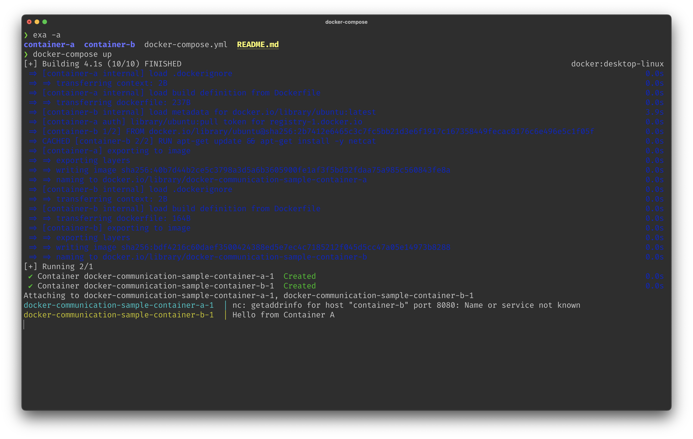

# Sample of basic Docker containerization (+ Docker Compose)

<details>
<summary>Why we need Docker? Microservices? What?</summary>
<spoiler>In the world of software development, microservices are a great way of breaking up your application into <b>smaller, more manageable pieces</b>. Each microservice is a small izolated application, which is responsible for a single task. This approach allows you <b>to scale your application more easily</b>, and also to develop and deploy each microservice independently.<br><br>For example, if you have a web application, a good way to break it up into microservices would be to have a separate backend, frontend, database, cache and authentication service. Each of these services would be responsible for a single task, and they would communicate with each other to form the whole application.<br><br>One of the greatest way to run microservices is to use <b>Docker containers</b>, that you will learn about in this sample repo.
</spoiler>
</details>


## Docker

> Docker — is a tool that allows you to run applications in containers, izolated from each other and from the host system. It allows you to package an application with all of its dependencies into a standardized unit for software development.

The goal of this sample repo is to show how to create 2 simple Docker containers, where the first one will be able to communicate with the second one.


### Dockerfile of the first container

```dockerfile
FROM ubuntu
RUN apt-get update && apt-get install -y netcat
CMD ["sh", "-c", "while true; do echo 'Hello from Container A' | nc container-b 8080; sleep 2; done"]
```

So, what's going on here?

- `FROM ubuntu` — we are using the official Ubuntu image as a base for our container (Yeah we could use Alpine since it's much smaller, but not here, sorry)
- `RUN apt-get update && apt-get install -y netcat` — we are installing `netcat` package, which will allow us to send messages to the second container
- `CMD ["sh", "-c", "while true; do echo 'Hello from Container A' | nc container-b 8080; sleep 2; done"]` — we are running a command that will send a message to the port `8080` of the container `container-b` every 2 seconds

### Dockerfile of the second container

```dockerfile
FROM ubuntu
RUN apt-get update && apt-get install -y netcat
CMD ["nc", "-l", "-p", "8080"]
```

The first 2 lines are the same as in the first container, but the last one is different:

- `CMD ["nc", "-l", "-p", "8080"]` — we are running a command that will listen to the port `8080` of the container via `netcat`

### Building and running containers

So, the only thing left is to build and run our containers. We have 2 options here:

- Build and run containers manually (If we would choose this option, we would have to build and run each container manually, but in that case we would have to build both containers before running them, specify the `--link` flag to make the containers communicate with each other and only then run them.)
- Use Docker Compose (recommended)

I will show you the second option, since it's more appropriate for our case.

> Docker Compose — is a tool for defining and running <b>multi-container Docker applications</b>. With Compose, you use a YAML file to configure your application's services. Then, with a single command, you create and <b>start all the services</b> from your configuration.

So, let's analyze my `docker-compose.yml` file:

```yaml
version: '3'

services:
  container-a:
    build:
      context: ./container-a
    ports:
      - "8080:8080"

  container-b:
    build:
      context: ./container-b
    depends_on:
      - container-a
```

- `version: '3'` — the version of the Compose file format (you can read more about it [here](https://docs.docker.com/compose/compose-file/))
- `services:` — here, we are specifying the services that we want to run

After that, we are specifying the configuration of each service:

- `container-a:` — the name of the service
- `build:` — we are specifying that we want to build the container
- `context: ./container-a` — we are specifying the path to the context of the build (in our case it's the `container-a` folder)
- `ports:` — we are specifying the ports that we want to expose
- `"8080:8080"` — we are specifying that we want to expose the port `8080` of the container to the port `8080` of the host machine

The configuration of the second container is the same, except for the `depends_on` part:

- `depends_on:` — we are specifying that the second container depends on the first one

So, now we can build and run our containers:

```bash
docker-compose up
```

> We could run it in the background, but we want to see the logs of the containers, so we are running it in the foreground. 



Andddd... That's it! :) We can see that the first container sent a message to the second one, and the second one received it. 